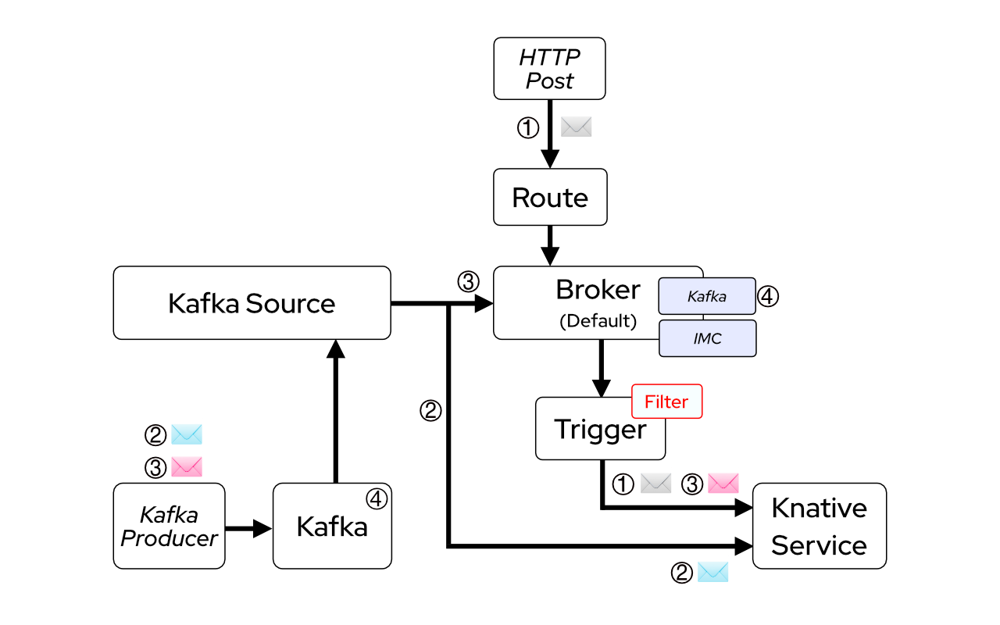

This time our aim is to use Kafka as a Source of Cloud Events.

Have another look to the next diagram this time pay attention to path ②.



First we need to create direct KafkaSource that sends events directly to our *logevents* Knative Service (ksvc).

> By the way (just in case you were wondering)... we can create a KafkaSource object because an administrator has installed the Knative Kafka Source operator previously for us.
> As you can imagine a Kafka cluster has been installed before you can run this lab specifically in namespace `kafka`.

> **Pay special attention to:**
> 
> * **spec->sink:** because it's pointing directly to a service
> * **spec-> bootstrapServers and topics:** because they point to the source of events in Kafka


```yaml
apiVersion: sources.eventing.knative.dev/v1alpha1
kind: KafkaSource
metadata:
  name: kafka-source
spec:
  consumerGroup: knative-group
  bootstrapServers: knative-demo-kafka-bootstrap.kafka:9092 #note the kafka namespace
  topics: eventing
  sink:
    apiVersion: serving.knative.dev/v1alpha1
    kind: Service
    name: logevents
```

```execute-1
oc apply -f ./scripts/descriptors/kafka-source-direct.yml -n labs-%userid%
```

Let's test it by sending messages to our topic in kafka:

```execute-1
oc -n labs-%userid% delete pod kafka-producer
oc -n labs-%userid% run kafka-producer -ti --image=strimzi/kafka:0.14.0-kafka-2.3.0 --rm=true --restart=Never -- bin/kafka-console-producer.sh --broker-list knative-demo-kafka-bootstrap.kafka:9092 --topic eventing
```

Now you can send events from the prompt. Copy the next text and paste it in the console where the kafka-producer is running.

```copy
{"message" : "Hi guys from kafka source!!"}
```

Let's check if there's a new pod being created...

```execute-2
oc get pod -n labs-%userid% | grep logevents
```

Finally let's have a quick look to the logs:

> Paste new messages at the kafka-producer prompt

```execute-2
oc logs -f $(oc get pod -n labs-%userid% | grep logevents | awk '{print $1}') -c user-container -n labs-%userid%
```

Ctrl+C (both consoles) when you're done with testing the trigger.

Upper:

```execute-2
<ctrl+c>
```
Lower:

```execute-2
<ctrl+c>
```